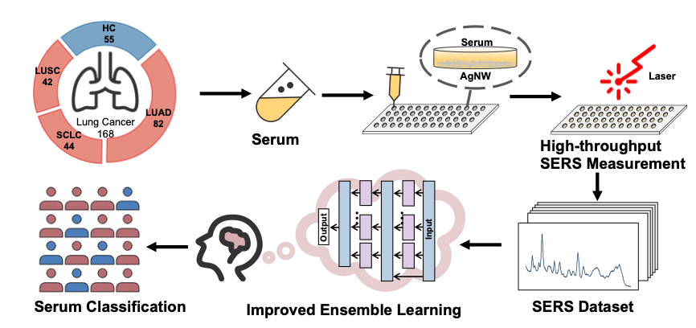
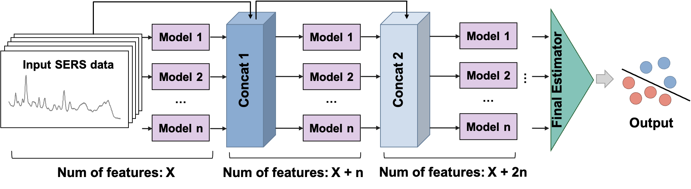

# Improved Ensemble Learning Enhanced Surface Controlled SERS Fingerprinting for Lung Cancer Diagnosis

## Abstract

The early diagnosis of lung cancer is crucial for improving patient prognosis, and liquid biopsy plays an important role in early lung cancer screening. In the field of liquid biopsy, label-free Surface-Enhanced Raman Scattering (SERS) possesses its unique advantages as it can provide comprehensive information about the insights into the chemical makeup of serum. However, the nonuniform SERS substrates poses challenges for reliable clinical diagnosis. We design a Surface Controlled SERS with Improved Ensemble Learning (SCSIEL) for lung cancer screening and diagnosis. This finely controlled SERS substrate ensures the uniformity of the surface and the high reproducibility of SERS spectra. The improved ensemble learning used in SCSIEL integrates several base models, but it achieves impressive results under the carefully constructed network. This *SCSIEL* system is also by direct analysis of clinical serum samples from 168 lung cancer patients and 55 healthy controls and the excellent performance is obtained with an area under the curve (AUC) of 95.4% and accuracy of 94.0%. This SCSIEL is also explainable, which reveals that the elevated blood phenylalanine indicates the enhanced protein degradation in lung cancer. The SCSIEL method is a reliable and cost-effective method in the screen of lung cancer.

## Model Architecture

